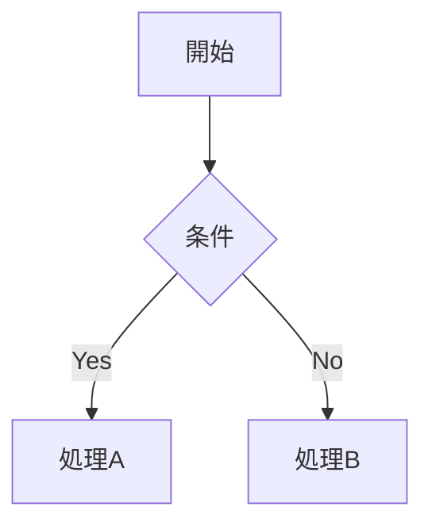

---
markdown:
  path: output.md
---
# Markdown 記法マニュアル

## 目次

1. [ブロック要素](#1-ブロック要素)
2. [インライン要素](#2-インライン要素)
3. [GFM の主な拡張](#3-gfm-の主な拡張)
4. [広く普及した追加機能(GFM仕様外)](#4-広く普及した追加機能gfm仕様外)
5. [GitHub サイト限定の機能](#5-github-サイト限定の機能)
6. [実践チェックリスト](#6-実践チェックリスト)

---

## 1. ブロック要素

### 1.1 見出し

**コード**

```markdown
# 見出しレベル1
## 見出しレベル2
###### 見出しレベル6
```

**表示結果**(実際の見出しにならないよう引用ブロックで表示)

> # 見出しレベル1
> ## 見出しレベル2
> ###### 見出しレベル6

- `#` の数がそのままレベルになる(1〜6)。
- GitHub では見出しが2つ以上あると目次(アウトラインメニュー)が自動生成される。
- 実務上は1ドキュメントに `H1` は1つだけにするのが望ましい。

**見出しIDの自動生成ルール**(多くのMarkdown環境で共通の事実上の標準)

1. 見出しテキストからリンクや強調などの書式を除去する。
2. 半角スペースをハイフン `-` に変換する。
3. `-` と `_` 以外の句読文字を除去する。
4. アルファベットを小文字化する(日本語などマルチバイト文字はそのまま)。
5. 同じIDが既に存在する場合は末尾に `-1`, `-2` ... と連番を付与する。

### 1.2 段落と改行

**コード**

```markdown
1行目のテキスト
2行目のテキスト

3行目は新しい段落
```

**表示結果**

1行目のテキスト
2行目のテキスト

3行目は新しい段落

空行のない改行(ソフト改行)は1行に連結される。強制的に改行(ハード改行)したい場合は行末に半角スペースを2つ入れる。

**コード**

```markdown
1行目(行末に半角スペース×2)
2行目
```

**表示結果**

1行目(行末に半角スペース×2)  
2行目

### 1.3 引用(Blockquote)

**コード**

```markdown
> 引用文の1行目
> 引用文の2行目
>
> > ネストされた引用
```

**表示結果**

> 引用文の1行目
> 引用文の2行目
>
> > ネストされた引用

引用の内部でも見出し・リスト・コードブロックなどMarkdown記法が有効。

### 1.4 リスト

**コード**

```markdown
- 項目1
- 項目2
  - ネストした項目
```

**表示結果**

- 項目1
- 項目2
  - ネストした項目

`-` `*` `+` はどれも同じ意味。ネストはスペース4つ(またはタブ1つ)のインデントで表現する。

**順序付きリスト**

**コード**

```markdown
1. 項目1
2. 項目2
```

**表示結果**

1. 項目1
2. 項目2

番号の数値そのものに意味はなく、レンダリング時は自動的に連番として描画される。

**タスクリスト(GFM拡張)**

**コード**

```markdown
- [x] 完了したタスク
- [ ] 未完了のタスク
```

**表示結果**

- [x] 完了したタスク
- [ ] 未完了のタスク

### 1.5 コードブロック

インデント形式(スペース4つ)は標準Markdownの基本仕様だがハイライトが付かないため、実務上はフェンス形式を使うのが一般的。

**コード**

````markdown
```python
def greet(name: str) -> str:
    return f"Hello, {name}"
```
````

**表示結果**

```python
def greet(name: str) -> str:
    return f"Hello, {name}"
```

- 言語名(info文字列)は**小文字**で書く(`javascript` は認識されるが `JavaScript` は認識されない環境がある)。
- ハイライトしたい言語が無い場合は `plain` を指定する。

### 1.6 水平線

**コード**

```markdown
---
```

**表示結果**

---

3つ以上の `-` `*` `_` のみで構成された行が水平線になる。

### 1.7 テーブル

**コード**

```markdown
| 左寄せ | 中央寄せ | 右寄せ |
| :----- | :------: | -----: |
| A      |    B     |      C |
```

**表示結果**

| 左寄せ | 中央寄せ | 右寄せ |
| :----- | :------: | -----: |
| A      |    B     |      C |

- ヘッダー行(1行目)と区切り行(2行目)が必須。
- 区切り行のコロンの位置で寄せを指定(`:---` 左、`:---:` 中央、`---:` 右)。

**GFMテーブルの制限**(表現できないものはHTMLの `<table>` を使う)

- ヘッダー行は必須、ヘッダー列(縦方向の見出し)は作れない。
- セル内にリストなど他のブロック要素を入れられない。
- `colspan` / `rowspan` / `class` などの属性を指定できない。
- Markdown表現の横幅が広くなりすぎる(目安150文字超)場合は可読性のためHTML表に切り替える。

---

## 2. インライン要素

### 2.1 強調

**コード**

```markdown
*イタリック*
**太字**
***太字イタリック***
~~取り消し線~~
```

**表示結果**

*イタリック*
**太字**
***太字イタリック***
~~取り消し線~~

前後に半角スペースがある文字列は強調と解釈されない。

**コード**

```markdown
y = 2 * x + 1
```

**表示結果**

y = 2 * x + 1

GFMでは単語内で複数回出現するアンダースコアは強調と解釈しない(スネークケースの識別子で誤爆しないための仕様)。

**コード**

```markdown
each_with_index
```

**表示結果**

each_with_index

上付き `<sup>` ・下付き `<sub>` は使用可能だが、可能な限り代替表現(べき乗は `^`、序数は英単語)を使う方がアクセシビリティ上望ましい。

### 2.2 リンク

**コード**

```markdown
[Anthropic](https://www.anthropic.com)
```

**表示結果**

[Anthropic](https://www.anthropic.com)

参照形式(定義を別の場所にまとめる書き方)も存在するが、可読性や保守性を優先する環境ではインラインリンクのみを使うよう指定されている場合がある。

**コード**

```markdown
[Anthropic][anthropic-ref]

[anthropic-ref]: https://www.anthropic.com
```

**表示結果**

[Anthropic][anthropic-ref]

[anthropic-ref]: https://www.anthropic.com

**その他のリンク**

- 自動リンク: `<https://example.com>` またはURLをそのまま貼るだけでも多くの環境でリンク化される。
- セクションリンク: `[テキスト](#見出しの自動生成id)`(1.1節参照)。
- 相対リンク: リポジトリ内の別ファイルを参照する場合は `docs/CONTRIBUTING.md` のような相対パスを使う(絶対URLはクローン後に機能しないことがあるため)。
- カスタムアンカー: `<a name="任意の名前"></a>` を本文中に置くと、見出し以外の位置にもリンクできる。

### 2.3 画像

**コード**

```markdown


```

表示結果は画像URLに依存するため省略。サイズ指定が必要な場合はHTMLの `` を使う。

### 2.4 インラインコード

**コード**

```markdown
`code`
```

**表示結果**

`code`

コード中にバッククォートそのものを含む場合は、外側を二重(以上)のバッククォートで囲む。

### 2.5 特殊文字のエスケープ

**コード**

```markdown
\*太字ではない\*
```

**表示結果**

\*太字ではない\*

これらの文字をMarkdown記法として解釈させたくない場合はバックスラッシュを前に置く: `\* \_ \` \{ \} \[ \] \( \) \# \+ \- \. \!`

---

## 3. GFM の主な拡張

標準Markdown(CommonMark)に対して GitHub Flavored Markdown が追加している主な仕様。

| 機能                       | 記法                                     |
| -------------------------- | ---------------------------------------- |
| 取り消し線                 | `~~文字列~~`                             |
| タスクリスト               | `- [ ]` / `- [x]`                        |
| テーブル                   | 1.7節参照                                |
| フェンス付きコードブロック | `` ``` `` で囲む(インデント不要)         |
| URLオートリンク            | URLをそのまま記述するだけでリンク化      |
| 単語内アンダースコアの無視 | `each_with_index` を誤って強調表示しない |

**コード**

```markdown
https://github.com
```

**表示結果**

https://github.com

---

## 4. 広く普及した追加機能(GFM仕様外)

GFMの正式仕様には含まれないが、GitHubをはじめ多くのMarkdown環境で共通して使えるようになっている機能。

### 4.1 アラート(Alerts)

**コード**

```markdown
> [!NOTE]
> 読み飛ばされがちだが知っておくべき情報。
```

**表示結果**

> [!NOTE]
> 読み飛ばされがちだが知っておくべき情報。

> [!TIP]
> より良く/簡単に行うためのアドバイス。

> [!IMPORTANT]
> 目標達成のために必須の重要情報。

> [!WARNING]
> 問題を避けるために即座の注意が必要な内容。

> [!CAUTION]
> 特定の操作によるリスクや悪影響についての注意。

5種類(NOTE / TIP / IMPORTANT / WARNING / CAUTION)。読者の負荷を避けるため、1記事あたり1〜2個程度に絞ることが推奨されている。アラート同士の入れ子、連続配置は避ける。

### 4.2 数式(LaTeX)

**コード**

```markdown
$$x = \frac{-b \pm \sqrt{b^2 - 4ac}}{2a}$$

質量 $m$ とエネルギー $E$ の関係は $E = mc^2$ で表される。
```

**表示結果**(数式対応環境で表示した場合)

$$x = \frac{-b \pm \sqrt{b^2 - 4ac}}{2a}$$

質量 $m$ とエネルギー $E$ の関係は $E = mc^2$ で表される。

- **ブロック**: 前後に空行を入れて `$$...$$`、または info文字列を `math` にしたコードブロック。
- **インライン**: `$...$`(前後に区切り文字、通常はスペースが必要)。
- 数式内に `$` を含める場合は `\$` とエスケープする。

### 4.3 ダイアグラム(Mermaid)

**コード**

````markdown

````

**表示結果**(Mermaid対応環境で表示した場合)


### 4.4 脚注

**コード**

```markdown
本文中の一節には脚注が付く[^1]。

[^1]: ここに脚注の内容を書く。
```

**表示結果**

本文中の一節には脚注が付く[^1]。

[^1]: ここに脚注の内容を書く。

- ラベルは数字に限らず任意の文字列(日本語も可)。
- 出力時は文書末尾にまとめて表示され、参照順に番号が振り直される。
- 参照されていない脚注は出力されない。

---

## 5. GitHub サイト限定の機能

リポジトリ内の `.md` ファイル単体のレンダリングではなく、GitHubのWeb UI(Issue/PR/コメントなど)でのみ有効な機能が中心。

### 5.1 絵文字

**コード**

```markdown
:smile: :+1:
```

**表示結果**

:smile: :+1:

`:octocat:` などGitHub独自絵文字も存在する。

### 5.2 メンション・自動リンク(コンテキスト依存)

| 機能                  | 記法・説明                                                                              |
| --------------------- | --------------------------------------------------------------------------------------- |
| メンション            | `@ユーザー名` / `@組織/チーム名` で通知が飛ぶ(実際の通知は本物のリポジトリ内でのみ発生) |
| Issue/PR自動リンク    | `#123` または `GH-123`                                                                  |
| コミットSHA自動リンク | ハッシュ値をそのまま貼るとリンク化                                                      |

### 5.3 色表現・地理データなど(Issue/PR/Gistコメント限定)

| 機能                 | 記法・説明                                                                                                                                             |
| -------------------- | ------------------------------------------------------------------------------------------------------------------------------------------------------ |
| 色見本               | バッククォート内に `` `#0969DA` `` / `` `rgb(9,105,218)` `` / `` `hsl(212,92%,45%)` `` と書くと色見本付きで表示(リポジトリ内`.md`ファイルでは効果なし) |
| GeoJSON/TopoJSON/STL | info文字列に `geojson` / `topojson` / `stl` を指定すると地図・3D形状として描画                                                                         |

### 5.4 その他

- Markdownレンダリングの無効化: ファイル表示画面で「Code」を選択すると生のソースを表示できる。
- コンテンツの非表示: `<!-- 表示されないコメント -->`

---

## 6. 実践チェックリスト

- [ ] 見出しレベルを飛び級(H1→H3など)していないか
- [ ] コードブロックの言語名(info文字列)は小文字になっているか
- [ ] テーブルにヘッダー行があり、幅が広すぎないか(目安150文字)
- [ ] アラートは1〜2個までに絞り、入れ子にしていないか
- [ ] リポジトリ内のファイル参照は絶対URLでなく相対リンクにしているか
- [ ] 上付き・下付き文字を多用していないか(可能なら代替表現へ)
- [ ] 数式中の `$` のエスケープ方法は投稿先の仕様に合っているか
- [ ] 参照形式リンクを使う必然性があるか(不要ならインラインへ統一)

---

## 参考資料

- higuma/markdown_cheat_sheet — <https://github.com/higuma/markdown_cheat_sheet>
- higuma/github-markdown-guide (GitHub特有の機能) — <https://github.com/higuma/github-markdown-guide/blob/main/github-specific.md>
- higuma/github-markdown-guide (その他の機能) — <https://github.com/higuma/github-markdown-guide/blob/main/other-features.md>
- MDN Web Docs「Markdown の書き方」 — <https://developer.mozilla.org/ja/docs/MDN/Writing_guidelines/Howto/Markdown_in_MDN>
- GitHub Docs「基本的な書き込みと書式設定の構文」 — <https://docs.github.com/ja/get-started/writing-on-github/getting-started-with-writing-and-formatting-on-github/basic-writing-and-formatting-syntax>
- Qiita「Markdown記法一覧」 — <https://qiita.com/oreo/items/82183bfbaac69971917f>
